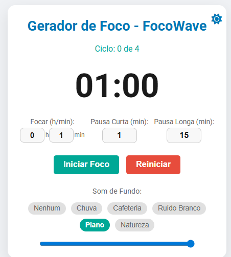
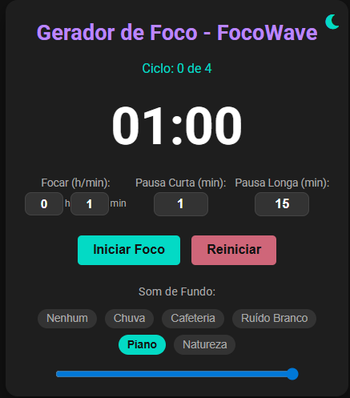
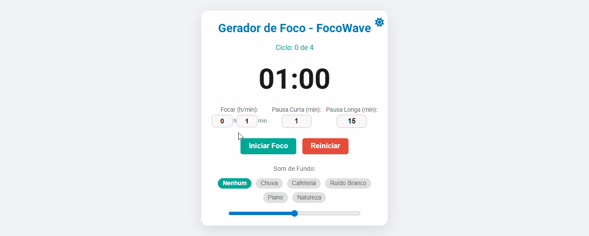

# ⏳ Gerador de Foco - FocoWave: Seu Aliado de Produtividade com a Técnica Pomodoro

<div align="center">
  <a href="https://focowaves.netlify.app/" target="_blank">
    
  </a>
</div>

<br>

<p align="center">
  <a href="#sobre">Visão Geral</a> •
  <a href="#demo">Demonstração</a> •
  <a href="#funcionalidades">Funcionalidades</a> •
  <a href="#atualizacao">Atualizações</a> •
  <a href="#tech">Tecnologias</a> •
  <a href="#instalacao">Instalação</a> •
  <a href="#roadmap">Roadmap</a>
</p>

---

<a id="sobre"></a>
## ✨ Visão Geral

O **FocoWave** é uma ferramenta web elegante e intuitiva, projetada para maximizar sua produtividade e concentração utilizando a renomada Técnica Pomodoro. Inspirado na simplicidade e eficácia, esta aplicação ajuda você a gerenciar seus tempos de trabalho e descanso de forma eficiente, promovendo sessões de foco ininterruptas e descansos merecidos.

Com uma interface limpa e personalizável, o Gerador de Foco oferece o ambiente ideal para quem busca otimizar a rotina de estudos ou trabalho, minimizando distrações e aumentando a atenção.

---

<a id="demo"></a>
## 📸 Demonstração Visual

Confira como o **FocoWave** se adapta ao seu estilo, seja no modo claro ou escuro.

<div align="center">
  <table>
    <tr>
      <td align="center"><b>🌞 Tema Claro</b></td>
      <td align="center"><b>🌚 Tema Escuro</b></td>
    </tr>
    <tr>
      <td>
        
      </td>
      <td>
        
      </td>
    </tr>
  </table>
</div>

### 🎥 Em Ação
Veja o FocoWave funcionando (Timer e troca de temas):



---
<a id="atualizacao"></a>
### [V1.2.1] - Otimização de Layout e Correções Críticas

Esta atualização foca em corrigir problemas de funcionalidade e layout, garantindo estabilidade total na navegação e nos controles.

#### ✅ Correções Críticas (Bug Fixes)

| Componente | Status | Descrição |
| :---: | :---: | :--- |
| **Controles** | **FIXED** | Corrigido o bug que impedia o funcionamento dos botões **Reiniciar** e **Pular** após a inicialização do script. |
| **Áudio** | **FIXED** | Estabilidade garantida para as músicas de fundo. A lógica do `AudioContext` foi refeita para iniciar e retomar de forma robusta no clique do usuário. |
| **Layout Geral** | **FIXED** | Eliminada a barra de rolagem vertical indesejada em 100% de zoom, otimizando o preenchimento e centralização do cartão. |

#### ✨ Melhorias e Otimizações

* **Otimização de Layout Vertical:** Implementada a estratégia **"Compacto & Largo"** (aumento do `max-width` para 450px e redução de margens verticais) para melhor aproveitamento de tela e alinhamento do conteúdo.
* **Onboarding Integrado:** A dica flutuante foi substituída por uma **Caixa de Informação (Info Box)** estática no rodapé do cartão.
* **Legibilidade do Ciclo:** Ajuste na explicação de ciclo com quebra de linha (`<br>`) para melhor clareza sobre o fluxo Foco > Pausa Curta > Pausa Longa.

---
## 🚀 Novidades da Versão 1.2.0

### 🌍 Internacionalização (i18n)
- **Suporte Multi-idioma:** O sistema agora fala **Português**, **Inglês** e **Espanhol**.
- **Layout Responsivo:** Adaptação inteligente do CSS para acomodar textos mais longos (como em espanhol) sem quebrar o design.
- **Zero Dependências:** Sistema de tradução criado 100% com Vanilla JavaScript (Dicionário de Objetos).

### 💾 Persistência "Real-Time" (Smart Timer)
- **Nunca perca o foco:** Se você fechar a aba ou o navegador, o timer continua rodando no "tempo real". Ao voltar, o tempo estará sincronizado, como se o aplicativo nunca tivesse sido fechado.
- **LocalStorage Avançado:** Salva todas as preferências do usuário (temas, sons, ciclos, idioma e estado do timer).

### 🧠 UX & Feedback Visual
- **Favicon Dinâmico:** O ícone da aba muda de cor (Verde/Amarelo) via SVG dinâmico para indicar se é hora de Focar ou Pausar, útil quando você está em outra aba.
- **Título Dinâmico:** O tempo restante aparece no título da aba do navegador.
- **Notificações Desktop:** Alertas nativos do navegador avisam quando o ciclo termina.

### ⚡ Controle de Fluxo
- **Auto-Start (Fluxo Contínuo):** Opção para iniciar o próximo ciclo automaticamente.
- **Botão Pular (Skip):** Permite avançar etapas se terminar a tarefa antes do tempo.
- **Ciclos Configuráveis:** O usuário decide quantos ciclos (3, 4, 5...) são necessários para a Pausa Longa.

### 🎧 Imersão Sonora
- **Novos Sons:** Adicionados "Weightless", "Ondas" e "Sweetest Dreams" à biblioteca de ruído branco.

---

## 🆕 O que há de novo na v1.1.0?

### ✨ Versão 1.1.0 - O Foco é Seu (Tema & Flexibilidade)
Esta atualização foca em entregar maior flexibilidade na definição do tempo e na experiência visual.

#### 🚀 Registro de Alterações (Changelog)

| Recurso | Descrição |
| :--- | :--- |
| **Tema Flexível (Claro/Escuro)** | Adicionado um botão de alternância (**sol/lua**) para trocar entre o Tema Escuro (padrão) e o novo Tema Claro. A preferência é salva no navegador. |
| **Foco Configurável (H/M)** | O tempo de **Foco** agora tem campos separados para **Horas** e **Minutos** (máximo de 10 horas). As pausas continuam em minutos. |
| **Persistência Completa** | Todas as configurações (tempos, tema, som e ciclo) são salvas no `localStorage`. |
| **Otimização de Layout** | Ajuste fino na escala e espaçamento dos inputs para garantir alinhamento perfeito em 100% de zoom. |
| **Ajuste Estético** | O botão de tema foi reposicionado para melhorar o equilíbrio visual. |

#### 💡 Guia Rápido (Novos Recursos)

1.  **Alternando Temas:** Use o botão (**Sol/Lua**) no canto superior direito.
2.  **Definindo Tempo de Foco (H/M):**
    * **Foco (h):** Insira as horas (ex: `1`).
    * **Foco (min):** Insira os minutos.
    * *> Nota: Pausas permanecem apenas em minutos.*

---

<a id="funcionalidades"></a>
## 🚀 Principais Funcionalidades (Geral)

- **Timer Personalizável:** Defina a duração exata para suas sessões de `Foco`, `Pausa Curta` e `Pausa Longa`.
- **Contador de Ciclos:** Monitore seu progresso visualmente (ex: "Ciclo: 1 de 4").
- **Sons Ambientes:** Escolha entre Chuva, Café, Ruído Branco, Piano Suave, Natureza ou Nenhum.
- **Alertas Sonoros:** Notificações discretas ao fim de cada sessão.
- **Persistência:** Suas configurações são salvas automaticamente (Local Storage).
- **Design Responsivo:** Layout otimizado para diversos dispositivos sem barras de rolagem desnecessárias.

<a id="tech"></a>
## 🛠️ Tecnologias Utilizadas

<div style="display: inline_block"><br>
  
  
  
  
</div>

## 📂 Estrutura do Projeto

```bash
FocoWave/
├── assets/          # Imagens (prints), ícones e sons
├── css/             # Estilos (style.css)
├── js/              # Lógica (script.js, timer.js)
├── index.html       # Estrutura principal
└── README.md        # Documentação
```

<a id="roadmap"></a>
## 🗺️ Roadmap (Próximos Passos)

- [x] Adicionar tema Dark/Light (v1.1.0)
- [x] Persistência de dados local
- [ ] Transformar em PWA (para instalar no celular)
- [ ] Adicionar dashboard de estatísticas semanais
- [ ] Integração com Spotify API

<a id="instalacao"></a>
## 💡 Como Usar

1.  **Defina seus Tempos:** Insira a duração desejada para Foco e Pausas.
2.  **Escolha seu Som:** Selecione o áudio de fundo ideal.
3.  **Comece a Focar:** Clique em "Iniciar Foco".
4.  **Reiniciar:** Use o botão "Reiniciar" para zerar o timer e ciclos.

## 💻 Instalação e Execução Local

Se você deseja rodar este projeto localmente, siga os passos abaixo:

<a id="instalacao"></a>
## 💻 Instalação e Execução Local

Se você deseja rodar este projeto localmente, siga os passos abaixo:

1. **Clone o repositório:**
   ```bash
   git clone [https://github.com/PatrickCaramico/FocoWave.git](https://github.com/PatrickCaramico/FocoWave.git)

   cd FocoWave

## 📄 Licença

Este projeto está licenciado sob a [Licença MIT](LICENSE).

---
<div align="center">
  <br>
  <p><b>Desenvolvido com por <a href="https://github.com/PatrickCaramico">Patrick Caramico</a></b></p>
</div>
